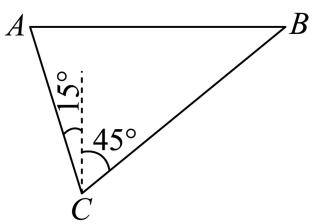

> [!faq]- 2024-2025学年内蒙古巴彦淖尔市高一（下）期末数学试卷解析
>
> > [!success]- **【答案】** A
>
> > [!note]- **【解析】**
> > 根据题意作图，
> >
> > 则 $BC = 20$ ， $\angle ACB = 15^{\circ} + 45^{\circ} = 60^{\circ}$ ， $\angle BAC = 90^{\circ} - 15^{\circ} = 75^{\circ}$
> >
> > $sin75^{\circ} = sin(30^{\circ} + 45^{\circ}) = \frac{1}{2}\times \frac{\sqrt{2}}{2} +\frac{\sqrt{3}}{2}\times \frac{\sqrt{2}}{2} = \frac{\sqrt{2} + \sqrt{6}}{4},$
> >
> > 在△ABC中，由正弦定理 $\frac{AB}{sin\angle ACB}=\frac{\overline{BC}}{sin\angle BAC}$ ，
> >
> > 得 $\frac{AB}{sin60^\circ} = \frac{20}{sin75^\circ}$ ，所以 $AB = \frac{10\sqrt{3}}{sin75^\circ}$
> >
> > 
> >
> > 所以 $AB = 10\sqrt{3} \times \frac{4}{\sqrt{2} + \sqrt{6}} = 30\sqrt{2} - 10\sqrt{6}$ .
> >
> > 所以A，B两点之间的距离为 $(30\sqrt{2}-10\sqrt{6})$ 米.
> >
> > 故选：A.
