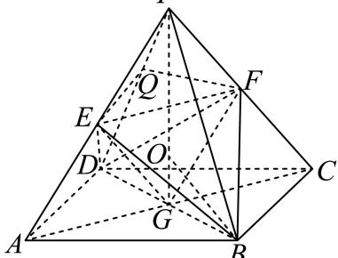

> [!faq]- 2024-2025学年内蒙古巴彦淖尔市高一（下）期末数学试卷解析
>
> > [!success]- **【答案】** ABD
>
> > [!note]- **【解析】**
> > 对A选项，取 $\{\overrightarrow{PA},\overrightarrow{PB},\overrightarrow{PC}\}$ 为空间向量的基底.
> >
> > 则 $\overrightarrow{PD} = \overrightarrow{PA} +\overrightarrow{AD} = \overrightarrow{PA} +\overrightarrow{BC} = \overrightarrow{PA} -\overrightarrow{PB} +\overrightarrow{PC}$
> >
> > 设 $\overrightarrow{PQ} = \lambda \overrightarrow{PD} = \lambda \overrightarrow{PA} -\lambda \overrightarrow{PB} +\lambda \overrightarrow{PC} = 2\lambda \overrightarrow{PE} -\lambda \overrightarrow{PB} +2\lambda \overrightarrow{PF}.$
> >
> > 又 $B, E, Q, F$ 四点共面，
> >
> > 所以 $2\lambda - \lambda + 2\lambda = 1$ ，解得 $\lambda = \frac{1}{3}$
> >
> > 所以 $\overrightarrow{PQ} = \frac{1}{3}\overrightarrow{PD}$ ，所以 $A$ 选项正确；
> >
> > 对B选项，如图，连接AC，设 $AC \cap BD = G$ ，
> >
> > 
> >
> > 易知平面 $PAC \perp$ 平面ABCD，PG⊥平面ABCD.
> >
> > 又 $E$ ， $F$ 分别为 $PA$ ， $PC$ 中点， $O$ 为 $AC$ 中点，
> >
> > 所以 $S_{\triangle EFG}=\frac{1}{4}S_{\triangle PAC}$ ，
> >
> > 所以 $V_{B-EFG}=\frac{1}{4}V_{B-PAC}$ ，同理 $V_{D-EFG}=\frac{1}{4}V_{D-PAC}$ ，
> >
> > 所以 $V_{B - EFG} + V_{D - EFG} = \frac{1}{4} V_{B - PAC} + \frac{1}{4} V_{D - PAC}$ ，即 $V_{E - BDF} = \frac{1}{4} V_{P - ABCD}$ ，所以 $B$ 选项正确
> >
> > 确；
> >
> > 对 $C$ ：若 $\frac{PA}{AB} = \frac{\sqrt{5}}{2}$ ，不妨设 $PA = \sqrt{5}, AB = 2$ ，则 $AG = \sqrt{2}, PG = \sqrt{3}.$
> >
> > $$
> > V _ {P - A B C D} = \frac {1}{3} \times S _ {\square A B C D} \bullet P G = \frac {1}{3} \times 4 \times \sqrt {3} = \frac {4 \sqrt {3}}{3}.
> > $$
> >
> > 又 $S_{\triangle PAB} = \frac{1}{2}\times 2\times 2 = 2$
> >
> > 设P-ABCD内切球的半径为r，
> >
> > 则 $V_{P - ABCD} = \frac{1}{3} (S_{\square ABCD} + 4S_{\triangle PAB})\bullet r$
> >
> > 即 $\frac{4\sqrt{3}}{3} = \frac{1}{3}\times (4 + 4\times 2)\bullet r$ ，解得 $r = \frac{\sqrt{3}}{3}$
> >
> > 设 $P - ABCD$ 外接球球心为 $O$ ，则 $O$ 在 $PG$ 上，设外接球半径为 $R$
> >
> > 则 $R^2 = (PG - R)^2 + BG^2$ ，所以 $R^2 = (\sqrt{3} - R)^2 + 2$ ，解得 $R = \frac{5\sqrt{3}}{6}$
> >
> > 所以 $\frac{r}{R} = \frac{\frac{\sqrt{3}}{3}}{\frac{5\sqrt{3}}{6}} = \frac{2}{5}$ ，所以 $C$ 选项错误；
> >
> > 对 $D$ 选项，由 $B$ 选项可知 $V_{E - ABD} = V_{F - BDD} = V_{E - BDF} = \frac{1}{4} V_{P - ABCD}$ ，且 $V_{P - EFB} = V_{P - EFD}$
> >
> > 所以 $V_{P-EFB}=V_{P-EFD}=\frac{1}{8}V_{P-ABCD}$ ，
> >
> > 又 $\frac{PQ}{PD} = \frac{1}{3}$
> >
> > 所以 $V_{E-PQF}=\frac{1}{3}V_{E-PDE}=\frac{1}{3}V_{P-EFD}=\frac{1}{24}V_{P-ABCD}$
> >
> > $$
> > V _ {P - B E Q F} = V _ {P - B E F} + V _ {P - E Q F} = \left(\frac {1}{8} + \frac {1}{2 4}\right) V _ {P - A B C D} = \frac {1}{6} V _ {P - A B C D}.
> > $$
> >
> > 所以正四棱锥P-ABCD被平面BEF分成的上、下两部分的体积之比为1:5，所以D选项正确.故选：ABD.
