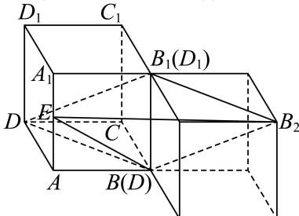

> [!faq]- 2024-2025学年内蒙古巴彦淖尔市高一（下）期末数学试卷解析
>
> > [!success]- **【答案】** $\frac{\sqrt{15}}{15}$
>
> > [!note]- **【解析】**
> > 将另一个与正方体 $ABCD - A_{1}B_{1}C_{1}D_{1}$ 一模一样的正方体的一个棱与 $BB_{1}$ 重合，如图所示，
> >
> > 
> >
> > 连接 $BD, BB_{2}, B_{2}E$ ，易知 $B_{1}B_{2} // BD$ ，且 $B_{1}B_{2} = BD$
> >
> > 所以四边形 $BDB_{1}B_{2}$ 为平行四边形，
> >
> > 所以 $DB_{1} \parallel BB_{2}$ ，且 $DB_{1} = BB_{2}$ ，所以 $\angle EBB_{2}$ 则为直线BE与 $B_{1}D$ 所成角或其补角，
> >
> > 设正方体ABCD-A1B1C1D1边长为2，
> >
> > $$
> > B E = \sqrt {2 ^ {2} + 1 ^ {2}} = \sqrt {5}, B B _ {2} = \sqrt {2 ^ {2} + 2 ^ {2} + 2 ^ {2}} = 2 \sqrt {3}, E B _ {2} = \sqrt {4 ^ {2} + 1 ^ {2} + 2 ^ {2}} = \sqrt {2 1}
> > $$
> >
> > 在 $\triangle EBB_{2}$ 中，由余弦定理可得
> >
> > $$
> > \cos \angle E B B _ {2} = \frac {B E ^ {2} + B _ {2} B ^ {2} - B _ {2} E ^ {2}}{2 B E \times B _ {2} B} = \frac {1 2 + 5 - 2 1}{2 \times 2 \sqrt {3} \times \sqrt {5}} = - \frac {\sqrt {1 5}}{1 5}
> > $$
> >
> > 所以直线BE与 $B_{1}D$ 所成角的余弦值为 $\frac{\sqrt{15}}{15}$ .
> >
> > 故答案为： $\frac{\sqrt{15}}{15}$ .
