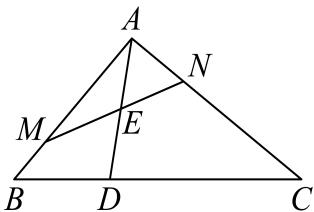

> [!faq]- 2024-2025学年内蒙古巴彦淖尔市高一（下）期末数学试卷解析
>
> > [!success]- **【答案】** $\frac{3}{10}$
>
> > [!note]- **【解析】**
> > 因为 $\overrightarrow{BC} = 3\overrightarrow{BD}$ ，为 $E$ 是线段 $AD$ 的中点， $\overrightarrow{AM} = \frac{3}{4}\overrightarrow{AB},\overrightarrow{AN} = m\overrightarrow{AC}$
> >
> > 所以 $\overrightarrow{BD} = \frac{1}{3}\overrightarrow{BC} = \frac{1}{3} (\overrightarrow{AC} -\overrightarrow{AB})$
> >
> > $$
> > \overrightarrow {A D} = \overrightarrow {A B} + \overrightarrow {B D} = \overrightarrow {A B} + \frac {1}{3} (\overrightarrow {A C} - \overrightarrow {A B}) = \frac {2}{3} \overrightarrow {A B} + \frac {1}{3} \overrightarrow {A C}
> > $$
> >
> > 所以 $\overrightarrow{AE} = \frac{1}{2}\overrightarrow{AD} = \frac{1}{3}\overrightarrow{AB} +\frac{1}{6}\overrightarrow{AC} = \frac{4}{9}\overrightarrow{AM} +\frac{1}{6m}\overrightarrow{AN},$
> >
> > 又因为 $M, E, N$ 三点共线，所以 $\frac{4}{9} + \frac{1}{6m} = 1$ ，解得 $m = \frac{3}{10}$ .
> >
> > 
> >
> > 故答案为： $\frac{3}{10}$ .
