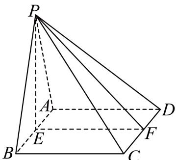

> [!faq]- 2024-2025学年内蒙古巴彦淖尔市高一（下）期末数学试卷解析
>
> > [!success]- **【答案】** 详见解析
>
> > [!note]- **【解析】**
> > 详见解析
> >
> > (1) 证明：设 $PC = \sqrt{2} = \sqrt{2} AB$
> >
> > 因此 $AB = 1$ ，即底面正方形边长是1，等边三角形 $\triangle PAB$ 的边长是1，由 $PC = \sqrt{2}$ ， $PB = BC = 1$ ，即 $PC^2 = PB^2 +BC^2$ ，因此 $BC\bot PB$ ，显然 $BC\bot AB$ 又 $PB\cap AB = B$ ， $PB$ ， $AB\subset$ 平面 $PAB$ ，因此 $BC\bot$ 平面 $PAB$
> >
> > 又 $BC \subset$ 平面ABCD，因此平面PAB⊥平面ABCD.
> >
> > 
> >
> > 作 $PE \perp AB$ 垂足为E，作 $EF \perp CD$ ，垂足为F，连接PF，
> > 平面 $PAB \perp$ 平面 $ABCD$ ， $PE \perp AB$ ， $PE \subset$ 平面PAB，平面 $PAB \cap$ 平面 $ABCD = AB$ ，于是 $PE \perp$ 平面 $ABCD$ ，由 $CD \subset$ 平面 $ABCD$ ，因此 $PE \perp CD$ ，又 $PE \cap EF = E$ ， $PE$ ， $EF \subset$ 平面PEF，因此 $CD \perp$ 平面PEF，又 $PF \subset$ 平面PEF，因此 $CD \perp PF$ ，又 $EF \perp CD$ ，因此 $\angle PFE$ 为平面PCD与平面ABCD所成角，
> > 由 $PE = \frac{\sqrt{3}}{2}$ ， $EF = 1$ ， $PF = \frac{\sqrt{7}}{2}$ ，因此 $sin\angle PFE = \frac{PE}{PF} = \frac{\sqrt{21}}{7}$
