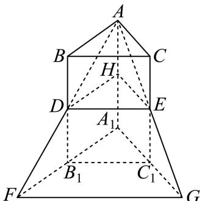

> [!faq]- 2024-2025学年内蒙古巴彦淖尔市高一（下）期末数学试卷解析
>
> > [!success]- **【答案】** 详见解析
>
> > [!note]- **【解析】**
> > 详见解析
> >
> > （1）设 $\triangle A_{1}B_{1}C_{1}$ 的面积为 $S$ ，三棱柱 $ABC - A_{1}B_{1}C_{1}$ 的高为 $h$ ，则三棱柱 $ABC - A_{1}B_{1}C_{1}$ 的体积 $V_{1} = Sh.$
> >
> > ①作 $DH \parallel AB$ ，交 $AA_{1}$ 于点H，连接EH，
> >
> > 因为 $DH \notin$ 平面 $ABC, AB \subset$ 平面 $ABC$ , 因此 $DH \parallel$ 平面 $ABC$ ,
> >
> > 因为 $BD \parallel CE$ ，且BD = CE，因此 $BC \parallel DE$ ，
> >
> > 又 $DE \notin$ 平面 $ABC, BC \subset$ 平面 $ABC$ , 因此 $DE \parallel$ 平面 $ABC$ ,
> >
> > 又 $DH \cap DE = D$ ，因此平面 $DEH \parallel$ 平面ABC，
> >
> > 因为 $BD = \frac{1}{2} BB_{1}$ ，因此 $H$ 为棱 $AA_{1}$ 的中点，
> >
> > $$
> > H D E - A _ {1} B _ {1} C _ {1}
> > $$
> >
> > $$
> > V _ {H D E - A _ {1} B _ {1} C _ {1}} = \frac {1}{2} V _ {1} = 9
> > $$
> >
> > $$
> > A - D E H
> > $$
> >
> > $$
> > V _ {A - D E H} = \frac {1}{6} V _ {1} = 3.
> > $$
> >
> > 故三棱柱 $ABC - A_{1}B_{1}C_{1}$ 与三棱锥 $A - A_{1}FG$ 重合部分的体积
> >
> > $$
> > V _ {\text {公共}} = V _ {H D E - A _ {1} B _ {1} C _ {1}} + \bar {V} _ {A - D E H} = 9 + 3 = 1 2.
> > $$
> >
> > ②因为 $DH\parallel A_{1}B_{1}$ ，因此 $DH\parallel A_{1}F$ ，因此 $\triangle ADH\sim\triangle AFA_{1}$
> >
> > 因此 $\frac{DH}{A_1F} = \frac{\overline{AH}}{AA_1} = \frac{BD}{BB_1} = \frac{1}{2}$ ，因此 $\frac{A_1B_1}{A_1F} = \frac{1}{2}$ .
> >
> > 因为 $DE \parallel B_1C_1$ ， $B_1C_1 \subset$ 平面 $A_1FG$ ， $DE \notin$ 平面 $A_1FG$ ，因此 $DE \parallel$ 平面 $A_1FG$ .
> >
> > 因为平面 $AFG \cap$ 平面 $A_{1}FG = FG$ ，且 $DE \subset$ 平面 $AFG$ ，
> >
> > 因此 $DE \parallel FG$ ，因此 $B_{1}C_{1} \parallel FG$
> >
> > 则 $\triangle A_{1}B_{1}C_{1}\sim \triangle A_{1}FG$ ，故 $S_{\triangle A_1FG} = 4S_{\triangle A_1B_1C_1} = 4S$
> >
> > 从而三棱锥 $A - A_{1}FG$ 的体积 $V_{2} = \frac{1}{3} S_{\triangle A_{1}FG}\bullet h = \frac{4}{3} Sh = 24$
> >
> > 故三棱柱 $ABC-A_{1}B_{1}C_{1}$ 与三棱锥 $A-A_{1}FG$ 的重合度
> >
> > $$
> > K = \frac {V _ {\text {公共}}}{V _ {1} + V _ {2} - V _ {\text {公共}}} = \frac {1 2}{1 8 + 2 4 - 1 2} = \frac {2}{5}.
> > $$
> >
> > 
> >
> > (2)设 $\frac{BD}{BB_1} = \lambda (0 < \lambda < 1)$ ，则 $BD = \lambda BB_{1}$ ，从而 $B_{1}D = (1 - \lambda)BB_{1}$ ，故三棱柱 $HDE - A_{1}B_{1}C_{1}$ 的体积 $V_{HDE - A_1B_1C_1} = (1 - \lambda)V_1$ ，三棱锥 $A - DEH$ 的体积 $V_{A - DEH} = \frac{\lambda}{3} V_1$ ，故三棱柱 $ABC - A_{1}B_{1}C_{1}$ 与三棱锥 $A - A_{1}FG$ 重合部分的体积 $V_{\text{公共}} = V_{HDE - A_1B_1C_1} + V_{A - DEH} = \frac{3 - 2\lambda}{3} V_1$ 。因为 $DH \parallel A_1B_1$ ，因此 $DH \parallel A_1F$ ，因此 $\triangle ADH \sim \triangle AFA_{1}$ ，因此 $\frac{DH}{A_1F} = \frac{AH}{AA_1} = \frac{BD}{BB_1} = \lambda$ ，因此 $\frac{A_1B_1}{A_1F} = \lambda$ 。因为 $DE \parallel B_1C_1, B_1C_1 \subset$ 平面 $A_1FG, DE \neq$ 平面 $A_1FG$ ，因此 $DE \parallel$ 平面 $A_1FG$ 。因为平面 $AFG \cap$ 平面 $A_1FG = FG$ ，且 $DE \subset$ 平面 $AFG$ ，因此 $DE \parallel FG$ ，因此 $B_1C_1 \parallel FG$ ，则 $\triangle A_1B_1C_1 \sim \triangle A_1FG$ ，故 $S_{\triangle A_1FG} = \frac{1}{\lambda^2} S_{\triangle A_1B_1C_1} = \frac{1}{\lambda^2} S$ ，从而三棱锥 $A - A_1FG$ 的体积 $V_{2} = \frac{1}{3} S_{\triangle A_1FG} \bullet h = \frac{1}{3\lambda^2} V_1$ ，故三棱柱 $ABC - A_1B_1C_1$ 与三棱锥 $A - A_1FG$ 的重合度 $K = \frac{\frac{3 - 2\lambda}{3} V_1}{V_1 + \frac{1}{3\lambda^2} V_1 - \frac{3 - 2\lambda}{3} V_1} = \frac{3\lambda^2 - 2\lambda^3}{2\lambda^3 + 1}$ 。因为 $K = \frac{1}{3}$ ，因此 $\frac{3\lambda^2 - 2\lambda^3}{2\lambda^3 + 1} = \frac{1}{3}$ ，因此 $8\lambda^3 - 9\lambda^2 + 1 = 0$ ，因此 $(\lambda - 1)(8\lambda^2 - \lambda - 1) = 0$ ，解得 $\lambda = 1$ 或 $\lambda = \frac{1 - \sqrt{33}}{16}$ 或 $\lambda = \frac{1 + \sqrt{33}}{16}$ 。因为 $0 < \lambda < 1$ ，因此 $\lambda = \frac{1 + \sqrt{33}}{16}$ 。
