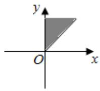
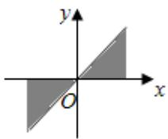
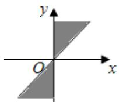
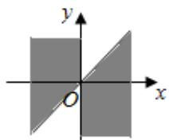

<!-- question-source:start -->
1、集合 $\{\alpha | k\pi + \frac{\pi}{4} \leqslant \alpha \leqslant k\pi + \frac{\pi}{2}, k \in Z\}$ 中的角所表示的范围（阴影部分）是（）

A

B

C

D

<!-- question-source:end -->

![[Q00090965A1]]
