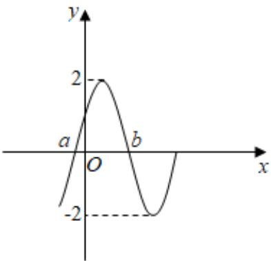

<!-- question-source:start -->
3、函数 $f(x)=A\sin(2x+\varphi)(A>0,\left|\varphi\right|<\frac{\pi}{2})$ 部分图象如图所示，对不同 $x_{1},x_{2}\in[a,b]$ ，若 $f(x_{1})=f(x_{2})$ ，有 $f(x_{1}+x_{2})=\sqrt{3}$ ，则（）
A $a + b = \pi$ B $b - a = \frac{\pi}{2}$ C $\varphi = \frac{\pi}{3}$ D $f(a + b) = \sqrt{3}$

<!-- question-source:end -->

![[Q00090975A1]]
