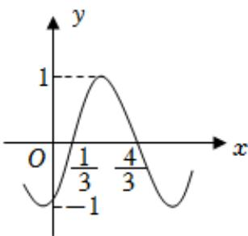

<!-- question-source:start -->
5、

已知函数 $f(x) = A \sin(\omega x + \varphi)(A > 0, \omega > 0, |\varphi| < \frac{\pi}{2})$ 的部分图象如图所示.

1 求 $A, \omega$ 和 $\varphi$ 的值；

2 求函数 $y = f(x)$ 在[1,2]上的单调递减区间；

3 若函数 $y = f(x)$ 在区间 $[a, b]$ 上恰有2020个零点，求 $b - a$ 的取值范围.
<!-- question-source:end -->

![[Q00090983A1]]
