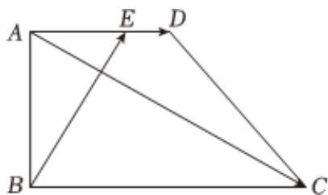

<!-- question-source:start -->
2. 如图，在直角梯形ABCD中，AD∥BC，AB⊥BC， $\overrightarrow{AE}=\lambda\overrightarrow{AD}$ ，BC=2AB=2AD=6。

1 若 $\overrightarrow{BE} \perp \overrightarrow{AC}$ , 求 $\lambda$ 的值;

2 $\lambda = \frac{2}{3}$ ，求向量 $\overrightarrow{AC}$ 与 $\overrightarrow{BE}$ 的夹角 $\theta$ 的余弦值.
<!-- question-source:end -->

![[Q00092397A1]]
