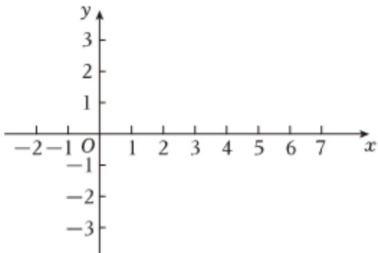

<!-- question-source:start -->
3. $$
y = 2 \sin \left(\frac {\pi}{4} x + \frac {\pi}{4}\right), x \in [ - 1, 7 ].
$$

1 运用“五点作图法”，列表—描点—连线，做出 $y=2\sin\left(\frac{\pi}{4}x+\frac{\pi}{4}\right)$ ， $x\in[-1,7]$ 的图像.

2

写出函数的振幅，最小正周期，初相.

<table><tr><td>x</td><td></td><td></td><td></td><td></td><td></td></tr><tr><td> $\frac{\pi}{4}x + \frac{\pi}{4}$ </td><td></td><td></td><td></td><td></td><td></td></tr><tr><td>y</td><td></td><td></td><td></td><td></td><td></td></tr></table>

1 若 $\sin\alpha=\frac{1}{3}$ ，求 $\cos\alpha,\tan\alpha$ 的值；

2 若 $\tan \alpha = 2$ ，求 $\frac{\sin^2\alpha - \cos^2\alpha}{\cos^2\alpha - 2\sin\alpha \cdot \cos\alpha}$ 的值.
<!-- question-source:end -->

![[Q00092398A1]]
