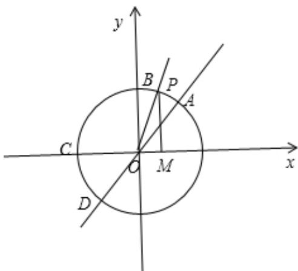

> [!faq]- 2024-2025学年内蒙古师大附中高一（下）第一次月考数学试卷解析
>
> > [!success]- **【答案】** 0
>
> > [!note]- **【解析】**
> > 因为 $f(n)=\cos\frac{n\pi}{2}$ ， $n\in Z$ ，函数 $f(x)$ 的最小正周期为4；
> > 则 $f(1)+f(2)+f(3)+\ldots+f(2025)$ $=0-1+0+1\cdots+0=506\times0+0=0.$ 故答案为：0.
> >
> > 
