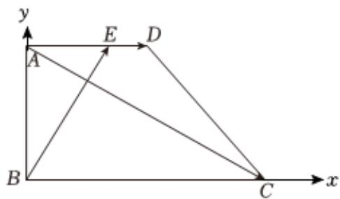

> [!faq]- 2024-2025学年内蒙古师大附中高一（下）第一次月考数学试卷解析
>
> > [!success]- **【答案】** 详见解析
>
> > [!note]- **【解析】**
> > 详见解析
> >
> > （1）直角梯形ABCD中， $AD \parallel BC$ ， $AB \perp BC$ ，
> > BC = 2AB = 2AD = 6.
> > 建立如图所示的直角坐标系，则B(0,0)，C(6,0)，A(0,3)，D(3,3)，设E(x,3)， $\overrightarrow{AE}=(x,0)$ ， $\overrightarrow{AD}=(3,0)$ ， $\overrightarrow{AE}=\lambda\overrightarrow{AD}$ 所以 $x=3\lambda,\overrightarrow{BE}=(x,3),\overrightarrow{AC}=(6,-3)$
> >
> > 
> >
> > 若 $\overrightarrow{BE} \perp \overrightarrow{AC}$ ，则 $\overrightarrow{BE} \bullet \overrightarrow{AC} = 6x - 9 = 0$ ，即 $x = \frac{3}{2}, \lambda = \frac{1}{2}$ ；
> >
> > (2) $\lambda = \frac{2}{3}$ , $\overrightarrow{AC} = (6, -3)$ , $\overrightarrow{BE} = (2, 3)$ , $\frac{6 \times 2 - 3 \times 3}{\sqrt{45 \times 13}} = \frac{\sqrt{65}}{65}$ .
> >
> > $$
> > \cos \theta = \frac {\overrightarrow {A C} \bullet \overrightarrow {B E}}{| \overrightarrow {A C} | | \overrightarrow {B E} |} = \frac {6 \times 2 - 3 \times 3}{\sqrt {4 5 \times 1 3}} = \frac {\sqrt {6 5}}{6 5}.
> > $$
