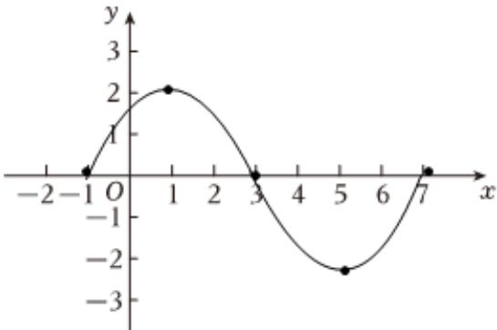

> [!faq]- 2024-2025学年内蒙古师大附中高一（下）第一次月考数学试卷解析
>
> > [!success]- **【答案】** 详见解析
>
> > [!note]- **【解析】**
> > 详见解析
> >
> > (1) 由 $y = 2 \sin \left( \frac{\pi}{4} x + \frac{\pi}{4} \right)$ , $x \in [-1,7]$ , 列表如下;
> >
> > <table><tr><td>x</td><td>-1</td><td>1</td><td>3</td><td>5</td><td>7</td></tr><tr><td> $\frac{\pi}{4}x + \frac{\pi}{4}$ </td><td>0</td><td> $\frac{\pi}{2}$ </td><td>π</td><td> $\frac{3\pi}{2}$ </td><td>2π</td></tr><tr><td>y = 2 sin( $\frac{\pi}{4}x + \frac{\pi}{4}$ )</td><td>0</td><td>2</td><td>0</td><td>-2</td><td>0</td></tr></table>
> >
> > 描点、连线，画出 $y=2\sin\left(\frac{\pi}{4}x+\frac{\pi}{4}\right)$ ， $x\in[-1,7]$ 的图像，如图所示：
> >
> > 
> >
> > (2)函数 $y=2\sin(\frac{\pi}{4}x+\frac{\pi}{4})$ 的振幅为2，最小正周期为 $\frac{2\pi}{\frac{\pi}{4}}=8$ ，初相为 $\frac{\pi}{4}$ .
