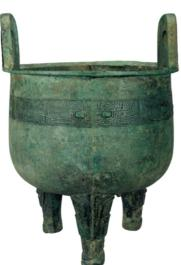
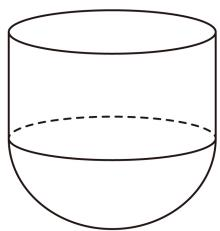

<!-- question-source:start -->
4、青铜大圆鼎（图1），厚立方耳、深鼓腹、圜底，三柱足略有蹄意，收藏于甘肃省博物馆。它的主体部分可以近似地看作是半球与圆柱的组合体（图2），忽略鼎壁厚度。已知半球的半径为 $\frac{1}{4}$ 米，圆柱的高近似于半球的半径，则此鼎的容积约为（）
A $\frac{5\pi}{96}$ 立方米
B $\frac{5\pi}{192}$ 立方米
C $\frac{\pi}{64}$ 立方米
D $\frac{7\pi}{192}$ 立方米

  
图1

  
图2
<!-- question-source:end -->

![[Q00092780A1]]
