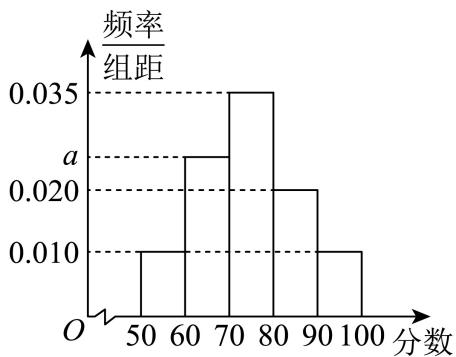

<!-- question-source:start -->
1、某零食超市某天接待了1250名顾客，老年375人，中青年625人，少年250人，景点为了提升服务质量，采用分层抽样从当天游客中抽取100人，以评分方式进行满意度回访。将统计结果按照[50, 60)，[60, 70)，[70, 80)，[80, 90)，[90, 100]分成5组，制成频率分布直方图如图：

1 求抽取的样本中老年、中青年、少年的人数
<!-- question-source:end -->

![[Q00092791A1]]
