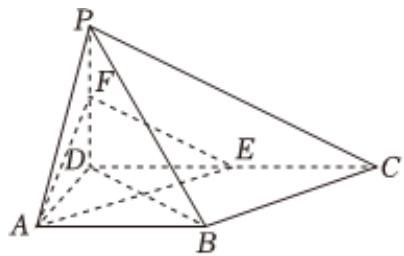

<!-- question-source:start -->
4、DeepSeek是由中国杭州的DeepSeek公司开发的人工智能模型，在金融、医疗健康、智能制造、教育等多个领域都有广泛的应用场景。为提高DeepSeek的应用能力，某公司组织A，B两部门的员工参加培训。

1

已知该公司A，B部门分别有3名领导，此次培训需要从这6名部门领导中随机选取2人负责，假设每人被抽到的可能性都相同，试写出其样本空间Ω，并求出事件“选取的2人全部来自A部门领导”的概率；

2

此次培训分三轮进行，每位员工第一轮至第三轮培训达到“优秀”的概率分别为 $\frac{2}{3}$ ， $\frac{2}{3}$ ， $\frac{1}{2}$ ，每轮培训结果相互独立，至少两轮培训达到“优秀”的员工才能合格，求每位员工经过培训合格的概率；

3

从(1)中的6名领导中，随机选两名领导分别负责第一天和第二天的工作，求第一天选到A部门领导且第二天选到B部门领导的概率。(无需过程，直接作答）

在四棱锥P-ABCD中， $PD \perp$ 平面ABCD, $AB \parallel DC$ , $AD \perp DC$ , DA = AB = PD = 2, DC = 4, E, F分别为棱CD, PD的中点.

1 求证： $AB \perp$ 平面PAD；

2 求证： $PB//$ 平面 $AEF$ ；

3 求二面角P-BC-A的正弦值.
<!-- question-source:end -->

![[Q00092794A1]]
