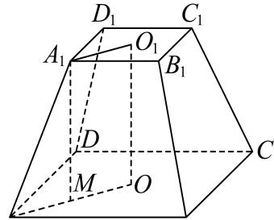

> [!faq]- 2024-2025学年内蒙古牙克石林业一中高一（下）第三次模拟数学试卷解析
>
> > [!success]- **【答案】** D
>
> > [!note]- **【解析】**
> > 如图： $O$ ， $O_{1}$ 分别为下、上底面的中心，连接 $A_{1}O_{1}$ ， $AO$ ，作 $A_{1}M / / OO_{1}$ 交 $AO$ 于点 $M$
> >
> > 
> >
> > 因为 $S_{\text{上}} = (\sqrt{2})^2 = 2$ ， $S_{\text{下}} = (2\sqrt{2})^2 = 8$
> >
> > 所以
> >
> > $$
> > V _ {A B C D - A _ {1} B _ {1} C _ {1} D _ {1}} = \frac {1}{3} O O _ {1} (S _ {\text {上}} + S _ {\text {下}} + \sqrt {S _ {\text {上}} \cdot S _ {\text {下}}}) = \frac {1}{3} O O _ {1} (2 + 8 + \sqrt {2 \times 8}) = 1 4 \Rightarrow O O _ {1}
> > $$
> >
> > $\dot{A}_{1}O_{1}=1, AO=2, A_{1}M=OO_{1}=3,$
> >
> > 则 $AM = AO - A_{1}O_{1} = 1$ ， $A_{1}A = \sqrt{AM^{2} + A_{1}M^{2}} = \sqrt{10}$
> >
> > 又 $A_{1}A$ 与平面ABCD所成角为 $\angle A_{1}AM$ ，
> >
> > 所以 $cos\angle A_{1}AM=\frac{AM}{AA_{1}}=\frac{\sqrt{10}}{10}.$
> >
> > 故选：D.
