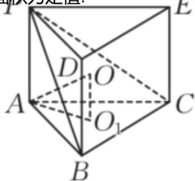

> [!faq]- 2024-2025学年内蒙古牙克石林业一中高一（下）第三次模拟数学试卷解析
>
> > [!success]- **【答案】** $\frac{44\pi}{3}$
>
> > [!note]- **【解析】**
> > 由题意得 $\angle BAC$ 为锐角， $BC > AB$ ，所以 $\triangle ABC$ 只有一解，即 $\triangle ABC$ 的面积为定值.
> >
> > 
> >
> >
> > 3、由题意得∠BAC为锐角，BC > AB，所以△ABC只有一解，即△ABC的面积为定值。
> > 所以当三棱锥P - ABC的体积最大时，PA⊥平面ABC。
> > 如图，将三棱锥P - ABC补成三棱柱ABC - PDE，设底面外接圆的圆心为O₁，
> > 三棱锥外接球的球心为O，连接AO，AO₁，OO₁，则AO₁为底面外接圆的半径，AO为三棱锥外接球的半径。
> > 由cos∠BAC = $\frac{1}{4}$ ，得sin∠BAC = $\frac{\sqrt{15}}{4}$ ，由 $\frac{BC}{\sin\angle BAC} = 2AO_{1}$ ，得 $AO_{1}=\frac{2\sqrt{6}}{3}$ 因为 $OO_{1}\perp$ 平面ABC， $OO_{1}=\frac{1}{2}PA=1$ ，则 $OO_{1}\perp AO_{1}$ ，所以 $AO^{2}=OO_{1}^{2}+AO_{1}^{2}=\frac{11}{3}$ .
> > 故该三棱锥外接球的表面积为 $4\pi\cdot AO^{2}=\frac{44\pi}{3}$ .
> > 故答案为： $\frac{44\pi}{3}$
