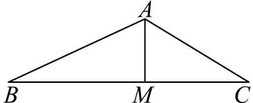

> [!faq]- 2024-2025学年内蒙古牙克石林业一中高一（下）第三次模拟数学试卷解析
>
> > [!success]- **【答案】** 详见解析
>
> > [!note]- **【解析】**
> > 详见解析
> >
> > (1)由题可知： $cosA = -\frac{1}{3}$ ，则 $sinA = \frac{2\sqrt{2}}{3}$ 且 $\frac{a}{sinA} = \frac{c}{sinC}$ ，可得 $c = \frac{asinC}{sinA}$
> >
> > 又 $a\sin C = 4\sqrt{2}$ ，所以 $c = \frac{4\sqrt{2}}{\frac{2\sqrt{2}}{3}} = 6$ .
> >
> > (2)作BC边上的高AM，如图：
> >
> > 
> >
> > 所以 $S_{\triangle ABC}=\frac{1}{2}bcsin A=10\sqrt{2}$ ，
> >
> > 由(1)可知 $c = 6$ ， $\sin A = \frac{2\sqrt{2}}{3}$ ，所以 $b = 5$
> >
> > 则 $BC = a^2 = b^2 + c^2 - 2bc\cos A \Rightarrow a = 9$
> >
> > $$
> > S _ {\triangle A B C} = \frac {1}{2} \cdot a \cdot A M = 1 0 \sqrt {2} \Rightarrow A M = \frac {2 0 \sqrt {2}}{9}.
> > $$
