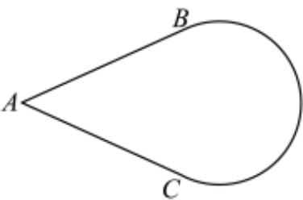

<!-- question-source:start -->
5、“函数 $y=\tan\left(\frac{x}{2}-\varphi\right)$ 的图象关于点 $\left(\frac{\pi}{4},0\right)$ 对称”是“ $\varphi=\frac{\pi}{8}+k\pi,k\in Z$ ”的（）
A 充分不必要条件
B 必要不充分条件
C 充要条件
D 既不充分也不必要条件

<!-- question-source:end -->

![[Q00092412A1]]
