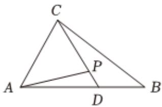

<!-- question-source:start -->
7、已知 $\frac{\pi}{4} \leq \alpha \leq \pi, \pi \leq \beta \leq \frac{3\pi}{2}, \sin 2\alpha = \frac{4}{5}, \cos (\alpha + \beta) = -\frac{\sqrt{2}}{10}$ ，则 $\beta - \alpha = ()$ A $\frac{3}{4}\pi$ B $\frac{\pi}{4}$ C $\frac{5}{4}\pi$ D $\frac{\pi}{2}$

<!-- question-source:end -->

![[Q00092414A1]]
