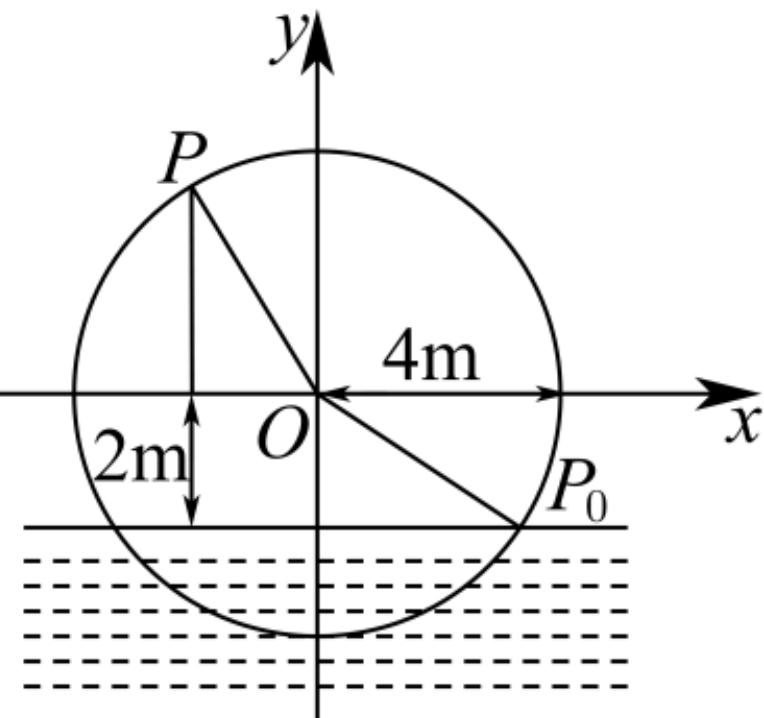
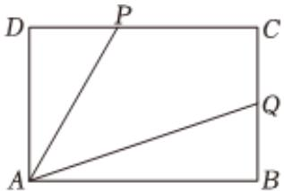

<!-- question-source:start -->
3、已知向量 $\overrightarrow{a} = (\sin (x - \frac{\pi}{3}),\sqrt{3}\cos x),\overrightarrow{b} = (\cos x,\cos x)$ ，且 $f(x) = 4\overrightarrow{a}\bullet \overrightarrow{b} -\sqrt{3}.$

1 求 $f(x)$ 的最小正周期；

2 求 $f(x)$ 的最小值及相应 $x$ 的取值集合；

3 求 $f(x)$ 的对称轴及单调递减区间.

筒车是我国古代发明的一种水利灌溉工具，因其经济又环保，至今还在农业生产中得到应用。假定在水流稳定的情况下，筒车上的每一个盛水筒都做匀速圆周运动。如图，将筒车抽象为一个几何图形（圆），一个半径为4米的水轮如图所示，水轮圆心O距离水面2米，且按逆时针方向匀速转动，每12s转动1圈。如果以水轮上点P从水面浮现时（图中点 $P_{0}$ 位置）开始计时，记点P距离水面的高度h（m）关于时间t（s）的函数解析式为h（t）=Asin（ωt+φ）+B（A>0，ω>0，|φ|<π/2）。（在水面下则h为负数）

1 求点P距离水面高度h（m）关于时间t（s）的函数解析式；

2 若水面下降 $(2\sqrt{3} - 2)m$ ，在水轮转动的一周内，求点P在水面下方的时间.

如图，点P，Q分别是矩形ABCD的边DC，BC上的两点，AB=3，AD=2。

1 若 $\overrightarrow{DP} = \lambda \overrightarrow{DC}$ , $\overrightarrow{CQ} = \lambda \overrightarrow{CB}$ , $0 \leq \lambda \leq 1$ , 求 $\overrightarrow{AP} \bullet \overrightarrow{AQ}$ 的范围;

2 若 $\angle PAQ = \frac{\pi}{4}$ ，求 $\overrightarrow{AP} \cdot \overrightarrow{AQ}$ 的最小值；

3 若 $\overrightarrow{DP} = 2\overrightarrow{PC}$ ，连接AP交BC的延长线于点T，Q为BC的中点，试探究线段AB上是否存在一点H，使得∠THQ最大。若存在，求BH的长；若不存在，说明理由。
<!-- question-source:end -->

![[Q00092423A1]]
