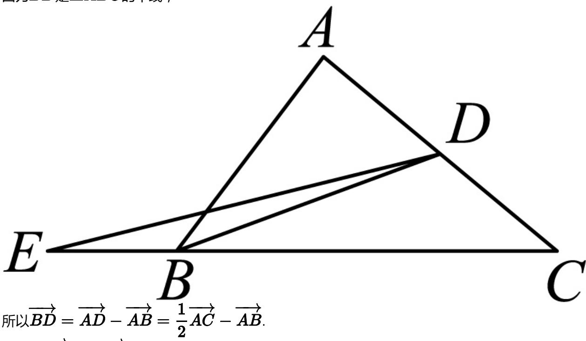

> [!faq]- 2024-2025学年内蒙古赤峰二中高一（下）第一次月考数学试卷解析
>
> > [!success]- **【答案】** C
>
> > [!note]- **【解析】**
> > 因为BD是△ABC的中线，
> >
> > 
> >
> > 所以 $\overrightarrow{BD} = \overrightarrow{AD} -\overrightarrow{AB} = \frac{1}{2}\overrightarrow{AC} -\overrightarrow{AB}.$
> >
> > 又因为 $\overrightarrow{CB} = 3\overrightarrow{BE}$
> >
> > $$
> > \overrightarrow {D E} = \overrightarrow {B E} - \overrightarrow {B D} = \frac {1}{3} (\overrightarrow {A B} - \overrightarrow {A C}) - (\frac {1}{2} \overrightarrow {A C} - \overrightarrow {A B}) = \frac {4}{3} \overrightarrow {A B} - \frac {5}{6} \overrightarrow {A C}.
> > $$
> >
> > 故选：C.
