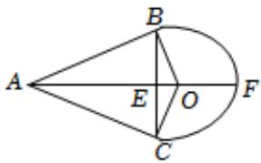

> [!faq]- 2024-2025学年内蒙古赤峰二中高一（下）第一次月考数学试卷解析
>
> > [!success]- **【答案】** A
>
> > [!note]- **【解析】**
> > 如图所示，设圆心为O，AO与圆弧相交于点F，连接OB，OC，则OB⊥AB，OC⊥AC.
> >
> > 设半径OB=r，AF=9x，则2r=5x，设 $\angle BAC=2\theta$ ，则 $\angle BAO=\theta$ .
> >
> > $$
> > \sin \theta = \frac {O B}{O A} = \frac {r}{9 x - r} = \frac {\frac {5}{2} x}{9 x - \frac {5}{2} x} = \frac {5}{1 3}
> > $$
> >
> > $\therefore \cos \angle BAC = 1 - 2\sin^2\theta = 1 - 2\times (\frac{5}{13})^2 = \frac{119}{169}$
> >
> > 
> >
> > 故选：A.
