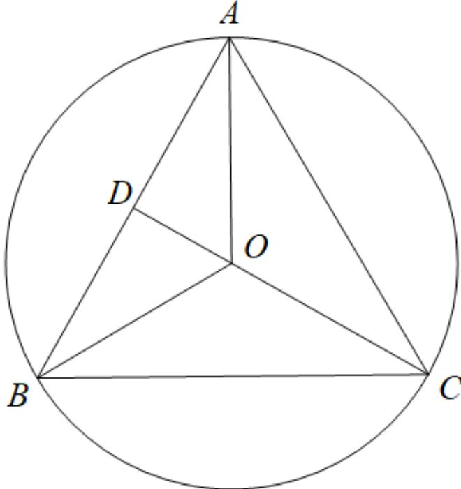
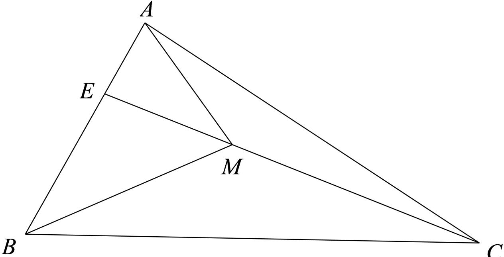

> [!faq]- 2024-2025学年内蒙古赤峰二中高一（下）第一次月考数学试卷解析
>
> > [!success]- **【答案】** ABD
>
> > [!note]- **【解析】**
> > 已知 $\triangle ABC$ 的外接圆的圆心为 $O$ ，角 $A = 60^{\circ}$
> >
> > 对于A选项：若 $|AB|=2$ ，取AB的中点D，连接OD，则 $OD\perp AB$ ，
> >
> > 
> >
> > 可知 $\overrightarrow{AO}$ 在向量 $\overrightarrow{AB}$ 方向上的投影向量为 $\overrightarrow{AD}$ ，
> >
> > 所以 $\overrightarrow{AB} \bullet \overrightarrow{AO} = |\overrightarrow{AB}| \bullet |\overrightarrow{AD}| = \frac{1}{2}\overrightarrow{AB}^2 = 2$ ，故 $A$ 选项正确；
> >
> > 对于B选项：若点M是△ABC内的动点（不含边界），且 $\overrightarrow{AM}=\frac{1}{2}\overrightarrow{AB}+\lambda\overrightarrow{AC}$
> >
> > 则 $\overrightarrow{AM} = x\overrightarrow{AB} +y\overrightarrow{AC}$ ，且 $\left\{ \begin{array}{ll}x > 0\\ y > 0\\ 0 <   x + y <   1 \end{array} \right.$
> >
> > 又因为 $\overrightarrow{AM} = \frac{1}{2}\overrightarrow{AB} +\lambda \overrightarrow{AC}$ ，则 $\left\{ \begin{array}{l}\lambda >0\\ 0 <   \frac{1}{2} +\lambda <  1 \end{array} \right.$ 解得 $0 <   \lambda <  \frac{1}{2}$
> >
> > 所以实数 $\lambda$ 的取值范围是 $0 < \lambda < \frac{1}{2}$ ，故 $B$ 选项正确；
> >
> > 对于C选项：若点M是△ABC内的动点（不含边界），且 $\overrightarrow{AM}=\frac{1}{5}\overrightarrow{AB}+\frac{2}{5}\overrightarrow{AC}$
> >
> > 设 $\overrightarrow{AB}=3\overrightarrow{AE}$
> >
> > 因为 $\overrightarrow{AM} = \frac{1}{5}\overrightarrow{AB} +\frac{2}{5}\overrightarrow{AC} = \frac{3}{5}\overrightarrow{AE} +\frac{2}{5}\overrightarrow{AC}$ ，可得 $\overrightarrow{AM} -\overrightarrow{AE} = \frac{2}{3} (\overrightarrow{AC} -\overrightarrow{AM})$
> >
> > 即 $\overrightarrow{EM} = \frac{2}{3}\overrightarrow{MC}$ ，可得 $\overrightarrow{EM} = \frac{2}{5}\overrightarrow{EC}$
> >
> > 
> >
> > 则 $S_{\triangle AMC} = \frac{3}{5} S_{\triangle AEC} = \frac{3}{5}\times \frac{1}{3} S_{\triangle ABC} = \frac{1}{5} S_{\triangle ABC}$ ，所以 $\frac{S_{\triangle AMC}}{S_{\triangle ABC}} = \frac{1}{5}$ ，故 $C$ 选项错误；
> >
> > 对于 $D$ 选项：若 $\overrightarrow{AO} = \lambda \overrightarrow{AB} +\mu \overrightarrow{AC}$ ， $\lambda \in R$ ， $\mu \in R$
> >
> > 设 $\triangle ABC$ 的外接圆半径为 $R$ ，
> >
> > 因为 $\angle BAC = \frac{\pi}{3}$ ，则 $\angle BOC = \frac{2\pi}{3}$
> >
> > 根据平面向量数量积公式可得 $\overrightarrow{OB} \bullet \overrightarrow{OC} = |\overrightarrow{OB}| \bullet |\overrightarrow{OC}| \angle BOC = -\frac{1}{2} R^2$
> >
> > 又因为 $\overrightarrow{AO} = \lambda \overrightarrow{AB} +\mu \overrightarrow{AC} = \lambda (\overrightarrow{AO} +\overrightarrow{OB}) + \mu (\overrightarrow{AO} +\overrightarrow{OC})$
> >
> > 可得 $1-(\lambda+\mu)$ $\overrightarrow{AO}=\lambda\overrightarrow{OB}+\mu\overrightarrow{OC}$
> >
> > 则 $[1 - (\lambda + \mu)]^2 \overrightarrow{AO}^2 = (\lambda \overrightarrow{OB} + \mu \overrightarrow{OC})^2 = \lambda^2 \overrightarrow{OB}^2 + \mu^2 \overrightarrow{OC}^2 + 2\lambda \mu \overrightarrow{OB} \bullet \overrightarrow{OC}$
> >
> > $$
> > [ 1 - (\lambda + \mu) ] ^ {2} R ^ {2} = \lambda^ {2} R ^ {2} + \mu^ {2} R ^ {2} - \lambda \mu R ^ {2}
> > $$
> >
> > $$
> > [ 1 - (\lambda + \mu) ] ^ {2} = \lambda^ {2} + \mu^ {2} - \lambda \mu = (\lambda + \mu) ^ {2} - 3 \lambda \mu
> > $$
> >
> > 整理可得 $\lambda \mu = \frac{2(\lambda + \mu) - 1}{3} \leq \frac{(\lambda + \mu)^2}{4}$ ，解得 $\lambda + \mu \leq \frac{2}{3}$ 或 $\lambda + \mu \geqslant 2$ （舍去），
> >
> > 当且仅当 $\lambda = \mu = \frac{1}{3}$ 时，等号成立，
> >
> > 所以 $\lambda +\mu$ 的最大值为 $\frac{2}{3}$ ，故 $D$ 选项正确
> >
> > 故选：ABD.
