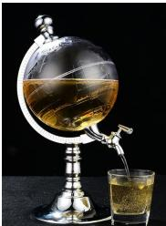

<!-- question-source:start -->
3、如图是一个直径为 $12 \mathrm{~cm}$ 的球形容器和一个底面直径为 $6 \mathrm{~cm}$ 、深 $8 \mathrm{~cm}$ 的圆柱形水杯（壁厚均不计），则球形容器装满时，约可以倒满水杯（）

A 3杯  
B 4杯  
C 5杯  
D 6杯
<!-- question-source:end -->

![[Q00091005A1]]
