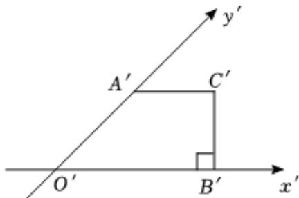

<!-- question-source:start -->
6、在 $\triangle ABC$ 中， $D$ 是 $AC$ 边的中点，且点 $M$ 满足 $\overrightarrow{BD} = 3\overrightarrow{BM}$ ，若 $\overrightarrow{AM} = \lambda \overrightarrow{AB} + \mu \overrightarrow{AC}$ ，则 $\lambda + \mu = (\quad)$ A $\frac{1}{2}$ B $\frac{2}{3}$ C $\frac{3}{4}$ D $\frac{5}{6}$

<!-- question-source:end -->

![[Q00091008A1]]
