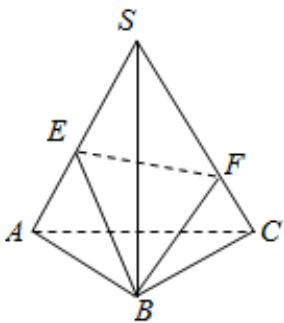

<!-- question-source:start -->
8、如图， $S - ABC$ 是正三棱锥且侧棱长为 $a$ ， $E$ ， $F$ 分别是 $SA$ ， $SC$ 上的动点，三角形 $BEF$ 的周长的最小值为 $\sqrt{2} a$ ，则侧棱 $SA$ ， $SC$ 的夹角为（）

A $30^{\circ}$ B $60^{\circ}$ C $20^{\circ}$ D $90^{\circ}$
<!-- question-source:end -->

![[Q00091010A1]]
