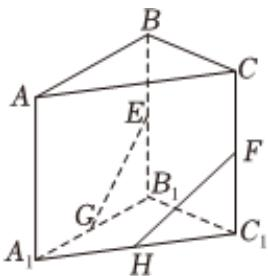

<!-- question-source:start -->
2、如图，在三棱柱 $ABC-A_{1}B_{1}C_{1}$ 中，E，F，G，H分别为 $BB_{1}$ ， $CC_{1}$ ， $A_{1}B_{1}$ ， $A_{1}C_{1}$ 的中点，则下列说法正确的是（）
A E, F, G, H 四点共面
B EG, FH 为异面直线
C EG, FH, AA₁ 三线共点
D $\angle EGB_{1} = \angle FHC_{1}$

<!-- question-source:end -->

![[Q00091012A1]]
