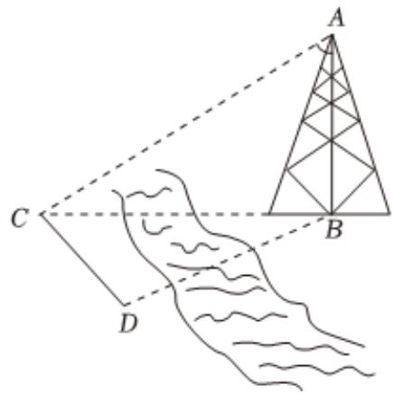

<!-- question-source:start -->
2、如图，测量河对岸的塔高 $AB$ 时，可以选取与塔底 $B$ 在同一水平面内的两个测量基点 $C$ 与 $D$ . 现测得 $\angle BCD = 60^{\circ}$ ， $\angle BDC = 75^{\circ}$ ， $CD = 60m$ ，并在点 $C$ 处测得塔顶 $A$ 的仰角 $\angle ACB = 30^{\circ}$

1 求 $B$ 与 $C$ 两点间的距离

2 求塔高AB
<!-- question-source:end -->

![[Q00091018A1]]
