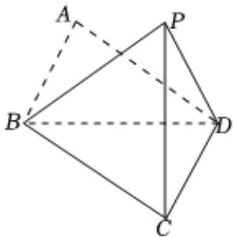

<!-- question-source:start -->
3、

如图，在四边形ABCD中，△ABD是等边三角形，△BCD是以BD为斜边的等腰直角三角形，将△ABD沿对角线BD翻折到△PBD，在翻折的过程中.

1 求证： $BD \perp PC$ ;

2 若 $DP \perp BC$ ，求证： $PC \perp$ 平面BCD.

<!-- question-source:end -->

![[Q00091019A1]]
