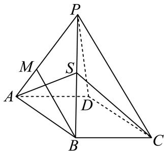

<!-- question-source:start -->
4、

如图所示，正四棱锥P-ABCD，PA=1，底面边长 $AB=\frac{\sqrt{2}}{2}$ ，M为侧棱PA上的点，且PM=3MA.

1 求正四棱锥 $P - ABCD$ 的体积；

2 若 $S$ 为 $PB$ 的中点，证明： $PD \parallel$ 平面 $SAC$ ；

3 侧棱 $PD$ 上是否存在一点 $\pmb{E}$ ，使 $CE \parallel$ 平面 $MBD$ ，若存在，求出 $\frac{PE}{ED}$ ；若不存在，请说明理由.
<!-- question-source:end -->

![[Q00091020A1]]
