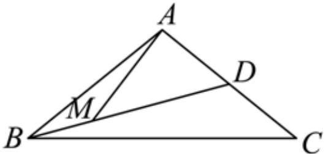

> [!faq]- 2024-2025学年内蒙古赤峰二中高一（下）第二次月考数学试卷解析
>
> > [!success]- **【答案】** D
>
> > [!note]- **【解析】**
> > 由 $\overrightarrow{BD} = 3\overrightarrow{BM}$ ，可得 $\overrightarrow{AD} -\overrightarrow{AB} = 3(\overrightarrow{AM} -\overrightarrow{AB})$ ，整理得 $\overrightarrow{AM} = \frac{2}{3}\overrightarrow{AB} +\frac{1}{3}\overrightarrow{AD}$ 结合 $D$ 为 $AC$ 中点，可得 $\overrightarrow{AD} = \frac{1}{2}\overrightarrow{AC}$ ，所以 $\overrightarrow{AM} = \frac{2}{3}\overrightarrow{AB} +\frac{1}{6}\overrightarrow{AC}$
> >
> > 
> >
> > 结合题意 $\overrightarrow{AM} = \lambda \overrightarrow{AB} +\mu \overrightarrow{AC}$ ，可得 $\lambda = \frac{2}{3},\mu = \frac{1}{6}$ ，所以 $\lambda +\mu = \frac{5}{6}$
> >
> > 故选：D.
