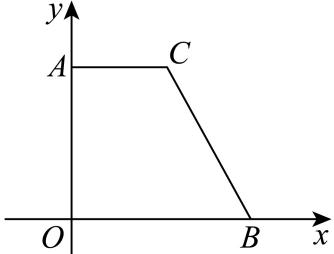

> [!faq]- 2024-2025学年内蒙古赤峰二中高一（下）第二次月考数学试卷解析
>
> > [!success]- **【答案】** B
>
> > [!note]- **【解析】**
> > 因为 $A^{\prime}C^{\prime}\parallel O^{\prime}B^{\prime},A^{\prime}C^{\prime}\perp B^{\prime}C^{\prime},A^{\prime}C^{\prime}=1,O^{\prime}B^{\prime}=2,$
> >
> > $$
> > O ^ {\prime} A ^ {\prime} = \left(O ^ {\prime} B ^ {\prime} - A C ^ {\prime}\right) \times \frac {1}{\cos 4 5 ^ {\circ}} = (2 - 1) \times \sqrt {2} = \sqrt {2}
> > $$
> >
> > 所以原图形AOBC中, $AC \parallel OB$ , AC = 1, OB = 2.
> >
> > 所以 $AO=2A'O'=2\times\sqrt{2}=2\sqrt{2}$ ，且 $OA\perp OB$ ，
> >
> > 如图，得到原图.
> >
> > 
> >
> > 因为梯形AOBC以边AO为轴旋转一周，所以得到的几何体为圆台.
> >
> > $$
> > r _ {1} = A C = 1, r _ {2} = O B = 2 \text {, 高} h = O A = 2 \sqrt {2}
> > $$
> >
> > 根据圆台体积公式，可得
> >
> > $$
> > V = \frac {1}{3} (S _ {1} + S _ {2} + \sqrt {S _ {1} S _ {2}}) h = \frac {1}{3} (\pi \times 1 ^ {2} + \pi \times 2 ^ {2} + \sqrt {\pi \times 1 ^ {2} \times \pi \times 2 ^ {2}}) \times 2 \sqrt {2} = \frac {1 4 \sqrt {2}}{3} \pi .
> > $$
> >
> > 故选：B.
