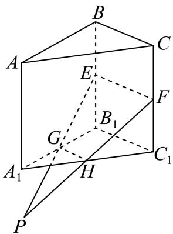

> [!faq]- 2024-2025学年内蒙古赤峰二中高一（下）第二次月考数学试卷解析
>
> > [!success]- **【答案】** AC
>
> > [!note]- **【解析】**
> > 连接EF，GH，
> >
> > 因为 $E$ ， $F$ ， $G$ ， $H$ 分别为 $BB_{1}$ ， $CC_{1}$ ， $A_{1}B_{1}$ ， $A_{1}C_{1}$ 的中点，
> >
> > 所以 $GH//B_{1}C_{1}//EF$
> >
> > 所以 $E$ ， $F$ ， $G$ ， $H$ 四点共面，故选项 $A$ 正确，选项 $B$ 错误；
> >
> > 延长EG，FH，相交于点P
> >
> > 由 $P \in EG$ ， $EG \subset$ 平面 $ABB_{1}A_{1}$ ，得 $P \in$ 平面 $ABB_{1}A_{1}$
> >
> > 由 $P \in FH$ ， $FH \subset$ 平面 $ACC_{1}A_{1}$ ，得 $P \in$ 平面 $ACC_{1}A_{1}$
> >
> > 因为平面 $ABB_{1}A_{1}\cap$ 平面 $ACC_{1}A_{1}=AA_{1}$ ，
> >
> > 所以 $P \in AA_{1}$
> >
> > 所以 $EG$ ，FH， $AA_{1}$ 三线共点，故选项 $\pmb{C}$ 正确；
> >
> > 因为 $EB_{1} = FC_{1}$
> >
> > 所以当 $GB_{1}\neq HC_{1}$ 时， $\tan\angle EGB_{1}\neq\tan\angle FHC_{1}$ ，
> >
> > 又 $0 < \angle EGB_{1}$ ， $\angle FHC_{1} < \frac{\pi}{2}$ ，所以 $\angle EGB_{1} \neq \angle FHC_{1}$ ，故选项 $D$ 错误.
> >
> > 故选：AC.
> >
> > 
