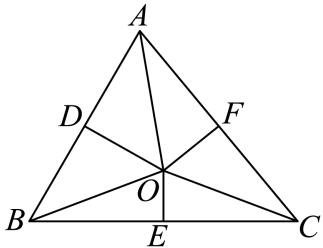

> [!faq]- 2024-2025学年内蒙古赤峰二中高一（下）第二次月考数学试卷解析
>
> > [!success]- **【答案】** A
>
> > [!note]- **【解析】**
> > A : 因为该三角形有两解，所以 $a \sin B < b < a$
> >
> > 则 $2 \times \frac{\sqrt{2}}{2} < b < 2$ ，即 $b \in (\sqrt{2}, 2)$ ，故 $A$ 选项错误；
> >
> > $B:\triangle ABC$ 中， $AB,BC,AC$ 的中点分别为 $D,E,F$ ，如图：
> >
> > 
> >
> > 由 $(\overrightarrow{OA} +\overrightarrow{OB})\cdot \overrightarrow{AB} = 0$ 得 $\overrightarrow{OD}\cdot \overrightarrow{AB} = 0$ ，即 $OD\bot AB$
> >
> > 所以 $OD$ 是 $AB$ 的垂直平分线，则 $OA = OB$
> >
> > 同理可得 $OE \perp BC$ ， $OF \perp AC$ ，则OA = OB = OC，
> >
> > 所以点O为△ABC的外心，故B选项正确；
> >
> > C : 因为△ABC为锐角三角形，
> >
> > 所以，当 $A + B > \frac{\pi}{2}$ 时， $A > \frac{\pi}{2} - B$ ，又 $y = \sin x$ 在 $(0, \frac{\pi}{2})$ 上单调递增，
> >
> > 于是 $\sin A > \sin\left(\frac{\pi}{2} - B\right) = \cos B$ ，即 $\sin A > \cos B$ ，
> >
> > 同理，可得 $\sin B > \cos C$ ， $\sin C > \cos A$
> >
> > 综上可知， $\sin A + \sin B + \sin C > \cos A + \cos B + \cos C$ ，故 $C$ 选项正确；
> >
> > $D$ ：设三边长为 $n - 1$ ， $n$ ， $n + 1$ ， $n$ 为大于1的正整数，对角分别为 $A$ 、 $B$ 、 $C$
> >
> > 若 $C = 2A$ ，从而 $\cos C = \cos 2A = 2\cos^2 A - 1$
> >
> > $$
> > \cos C = \frac {n ^ {2} + (n - 1) ^ {2} - (n + 1) ^ {2}}{2 n \cdot (n - 1)} = \frac {n - 4}{2 (n - 1)}
> > $$
> >
> > $$
> > \cos A = \frac {n ^ {2} + (n + 1) ^ {2} - (n - 1) ^ {2}}{2 n \cdot (n + 1)} = \frac {n + 4}{2 (n + 1)},
> > $$
> >
> > 所以 $\frac{n - 4}{2(n - 1)} = 2\left[\frac{n + 4}{2(n + 1)}\right]^2 - 1$ ，解得 $n = 5(-2, \frac{1}{2}$ 舍去），
> >
> > 所以存在三边为连续自然数4，5，6的三角形，使得最大角是最小角的两倍，故 $D$ 选项正确.
