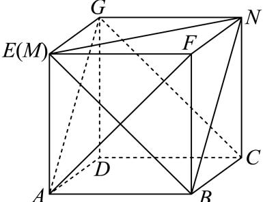

> [!faq]- 2024-2025学年内蒙古赤峰二中高一（下）第二次月考数学试卷解析
>
> > [!success]- **【答案】** $60^{\circ}$
>
> > [!note]- **【解析】**
> > 将平面展开图复原为如图所示的正方体：
> >
> > 
> >
> > 设正方体的棱长为a，连接EB，BN，
> >
> > 则 $EN = NB = EN = \sqrt{2}a$ ，
> >
> > 由正方体的性质可得 $GN \parallel AB$ ，GN = AB，
> >
> > 所以四边形ABNG为平行四边形，
> >
> > 所以 $AG \parallel BN$ ，
> >
> > 所以 $AG$ 与 $MN$ 所成的角即为 $\angle ENB$ 或其补角，
> >
> > 因为 $\angle ENB = 60^{\circ}$
> >
> > 所以 $AG$ 与 $MN$ 所成的角为 $60^{\circ}$ ，
> >
> > 故答案为： $60^{\circ}$
