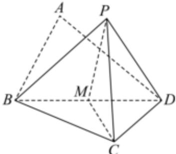

> [!faq]- 2024-2025学年内蒙古赤峰二中高一（下）第二次月考数学试卷解析
>
> > [!success]- **【答案】** 详见解析
>
> > [!note]- **【解析】**
> > 详见解析
> >
> > 证明：(1)如图，取BD的中点M，连接PM，CM，
> >
> > 
> >
> > 在等腰 $Rt\triangle BCD$ 中， $BC = CD$ ， $M$ 为 $BC$ 的中点，
> >
> > 所以CM⊥BD，
> >
> > 在等边△PBD中， $BD \perp PM$ ，
> >
> > 又 $PM \cap CM = M$ ，
> >
> > 所以 $BD \perp$ 平面PCM，
> >
> > 又PC⊂平面PCM，所以BD⊥PC.
> >
> > (2)因为在 $Rt\triangle BCD$ 中， $BC\perp CD$ ，
> >
> > 又 $BC \perp DP, CD \cap DP = D$
> >
> > 所以 $BC \perp$ 平面PCD，
> >
> > 又 $PC \subset$ 平面 $PCM$
> >
> > 所以 $BC \perp PC$
> >
> > $$
> > (1) \text {知} P C \perp B D, B C \cap B D = B
> > $$
> >
> > 所以 $PC \perp$ 平面BCD.
