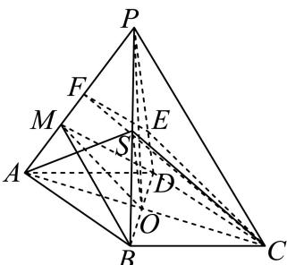

> [!faq]- 2024-2025学年内蒙古赤峰二中高一（下）第二次月考数学试卷解析
>
> > [!success]- **【答案】** 详见解析
>
> > [!note]- **【解析】**
> > 详见解析
> >
> > (1) 连接 $AC, BD$ ，设 $AC \cap BD = O$ ，连接 $PO$ ，则 $PO \perp$ 平面 $ABCD$ .
> >
> > $Rt\triangle POA$ 中， $PA = 1$ ， $AO = \frac{1}{2}$ ， $PO = \frac{\sqrt{3}}{2}$
> >
> > 所以 $V = \frac{1}{3} Sh = \frac{1}{3} \times \frac{1}{2} \times \frac{\sqrt{3}}{2} = \frac{\sqrt{3}}{12}$ .
> >
> > (2)证明：易知O为AC的中点，又S为PB的中点，
> >
> > 所以 $SO \parallel PD$ ，又 $SO \subset$ 平面SAC， $PD \notin$ 平面SAC，
> >
> > 所以 $PD \parallel$ 平面SAC；
> >
> > 
> >
> > (3)存在， $\frac{PE}{ED}=2$ .理由如下：作AP中点F，连结EF，EC，CF，
> >
> > 因为 $\frac{PF}{FM} = \frac{PE}{ED} = 2$ ，所以 $EF // MD$
> >
> > 又 $EF\not\subset$ 平面MBD，MD⊂平面MBD，
> >
> > 所以EF//平面MBD
> >
> > 又 $\frac{AM}{MF} = \frac{AO}{OC} = 1$ ，所以 $MO / / CF$
> >
> > 又 $CF \notin$ 平面MBD， $MO \subset$ 平面MBD
> >
> > 所以 $CF \parallel$ 平面MBD，又 $CF \cap EF = F$
> >
> > 所以平面 $CEF \parallel$ 平面MBD，又CE⊂平面CEF，
> >
> > 所以CE//平面MBD.
