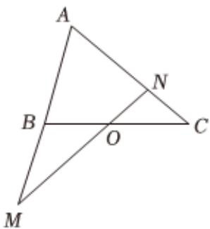

<!-- question-source:start -->
2、如图，在 $\triangle ABC$ 中，点 $O$ 是 $BC$ 的中点，过点 $O$ 的直线分别交直线 $AB$ ， $AC$ 于不同的两点 $M$ ， $N$ ，若 $\overrightarrow{AO}=\frac{m}{2}\overrightarrow{AM}+\frac{n}{2}\overrightarrow{AN}$ ， $m>0$ ， $n>0$ ，则 $\frac{2}{m}+\frac{8}{n}$ 的最小值为（）
A 2
B 8
C 9
D 18

<!-- question-source:end -->

![[Q00092425A1]]
