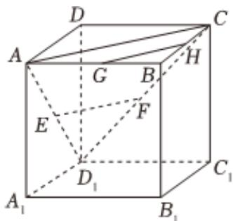

<!-- question-source:start -->
4、如图所示，在正方体 $ABCD - A_{1}B_{1}C_{1}D_{1}$ 中， $\pmb{E}$ ， $\pmb{F}$ 分别是侧面 $AA_{1}DD_{1}$ ，侧面 $CC_{1}DD_{1}$ 的中心， $\pmb{G}$ ， $\pmb{H}$ 分别是线段 $AB$ ， $BC$ 的中点，则直线 $EF$ 与直线 $GH$ 的位置关系是（）

A 相交  
B 异面  
C 平行  
D 无法确定
<!-- question-source:end -->

![[Q00092427A1]]
