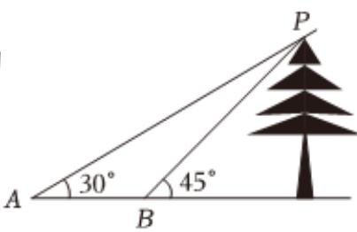

<!-- question-source:start -->
5、如图所示，为测量一树的高度，在地面上选取A，B两点，从A，B两点测得树尖的仰角分别为 $30^{\circ}$ 和 $45^{\circ}$ ，且A，B两点之间的距离为80m，则树的高度为（）

A $(40 + 40\sqrt{3})m$ B $(40 + 20\sqrt{3})m$ C $(20 + 40\sqrt{3})m$ D $(20 + 4\sqrt{3})m$

<!-- question-source:end -->

![[Q00092428A1]]
