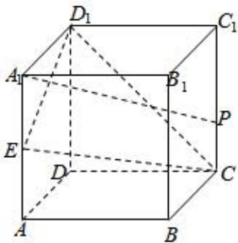

<!-- question-source:start -->
7、如图，棱长为2的正方体 $ABCD-A_{1}B_{1}C_{1}D_{1}$ 中，E为边 $AA_{1}$ 的中点，P为侧面 $BCC_{1}B_{1}$ 上的动点，且 $A_{1}P\parallel$ 平面 $CED_{1}$ .则点P在侧面 $BCC_{1}B_{1}$ 轨迹的长度为（）

A 2
B $\sqrt{3}$ C $\sqrt{5}$ D $\sqrt{2}$
<!-- question-source:end -->

![[Q00092430A1]]
