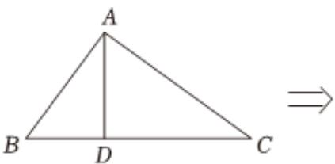
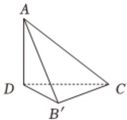

<!-- question-source:start -->
3、在中国古代数学著作《九章算术》中，鳖臑是指四个面都是直角三角形的四面体.如图，在直角 $\triangle ABC$ 中， $AD$ 为斜边 $BC$ 上的高， $AB=6$ ， $AC=8$ ，现将 $\triangle ABD$ 沿 $AD$ 翻折成 $\triangle AB'D$ ，使得四面体 $AB'CD$ 为一个鳖臑，则该鳖臑外接球的表面积为\_\_\_\_.

<!-- question-source:end -->

![[Q00092437A1]]
