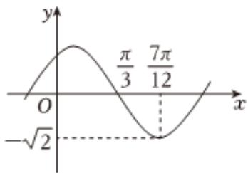

<!-- question-source:start -->
3、

函数 $f(x)=Asin(\omega x+\varphi)(A>0,\omega>0,|\varphi|<\frac{\pi}{2})$ 的部分图象如图所示：

1 求函数 $f(x)$ 的解析式；

2 求函数 $f(x)$ 在 $[0, \pi]$ 上的单调区间；

3 已知 $\alpha \in (0, \pi)$ , $f\left(\frac{\alpha}{2}\right) = \frac{1}{2}$ , 求 $\cos \alpha$ .
<!-- question-source:end -->

![[Q00092440A1]]
