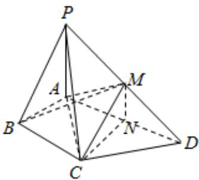

<!-- question-source:start -->
4、如图，在四棱锥 $P - ABCD$ 中， $\angle ABC = \angle ACD = 90^{\circ}$

$\angle BAC = \angle CAD = 60^{\circ}$ ， $PA\bot$ 平面ABCD， $PA = 2$ ， $AB = 1.$ 设 $M$ ， $N$ 分别为 $PD$ ， $AD$ 的中点.

(1)求证：平面CMN//平面PAB；

(2)求三棱锥P-ABM的体积.

<!-- question-source:end -->

![[Q00092441A1]]
