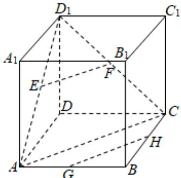

> [!faq]- 2024-2025学年内蒙古赤峰四中高一（下）月考数学试卷（5月份）解析
>
> > [!success]- **【答案】** C
>
> > [!note]- **【解析】**
> > 如图，
> >
> > 
> >
> > 连接 $AD_{1}$ ， $CD_{1}$ ，则 $\pmb{E}$ ， $\pmb{F}$ 分别为 $AD_{1}$ ， $CD_{1}$ 的中点，
> >
> > 由三角形中位线定理可得 $EF \parallel AC, GH \parallel AC$
> >
> > 由平行公理可得 $EF \parallel GH$ .
> >
> > 故选：C.
