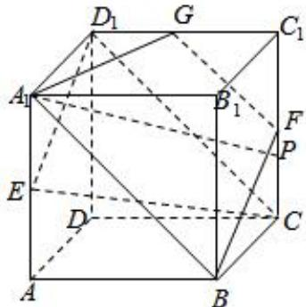

> [!faq]- 2024-2025学年内蒙古赤峰四中高一（下）月考数学试卷（5月份）解析
>
> > [!success]- **【答案】** C
>
> > [!note]- **【解析】**
> > 取 $C_{1}D_{1}$ ， $C_{1}C$ 的中点G，F，
> >
> > 
> >
> > 连接 $A_{1}G$ 、FG，BF， $A_{1}B$
> >
> > $\because GF \parallel D_{1}C, GF \notin$ 平面 $CED_{1}, GF \parallel$ 平面 $CED_{1}$
> >
> > $BF \parallel D_{1}E, BF \notin$ 平面 $CED_{1}, BF \parallel$ 平面 $CED_{1}$
> >
> > $\because BF, GF$ 是平面 $A_{1}GFB$ 内的相交直线，
> >
> > $\therefore$ 平面 $A_{1}GFB / /$ 平面 $CED_{1}$
> >
> > 故 $A_{1}P$ //平面 $CED_{1}$ 时，
> >
> > $P$ 在侧面 $BCC_{1}B_{1}$ 的轨迹是线段 $BF$
> >
> > ∵正方体ABCD-A\_{1}B\_{1}C\_{1}D\_{1}的棱长为2，
> >
> > 故 $BF=\sqrt{5}$ ,
> >
> > 故选：C.
