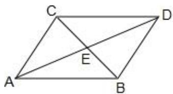

> [!faq]- 2024-2025学年内蒙古赤峰四中高一（下）月考数学试卷（5月份）解析
>
> > [!success]- **【答案】** BC
>
> > [!note]- **【解析】**
> > 已知向量 $\vec{a}$ ， $\vec{b}$ 不共线，向量 $\vec{a} +\vec{b}$ 平分 $\vec{a}$ 与 $\vec{b}$ 的夹角，
> >
> > 设 $\overrightarrow{AB} = \overrightarrow{a}$ ， $\overrightarrow{AC} = \overrightarrow{b}$
> >
> > 则 $\overrightarrow{AD} = \overrightarrow{a} +\overrightarrow{b}$
> >
> > 
> >
> > 由平行四边形法则可得： $|\overrightarrow{a}| = |\overrightarrow{b}|$ 且四边形ABDC为菱形，
> >
> > 对于选项A，显然错误；
> >
> > 对于选项 $B$ ， $(\vec{a} +\vec{b})\bullet (\vec{a} -\vec{b}) = \vec{a}^{2} - \vec{b}^{2} = 0$
> >
> > 即 $(\overrightarrow{a} +\overrightarrow{b})\perp (\overrightarrow{a} -\overrightarrow{b})$
> >
> > 即选项B正确；
> >
> > 对于选项C，向量 $\overrightarrow{a}$ ， $\overrightarrow{b}$ 在 $\overrightarrow{a}+\overrightarrow{b}$ 上的投影向量为 $\overrightarrow{AE}$ ，
> >
> > 即选项 $C$ 正确；
> >
> > 对于选项 $D$ ， $\overrightarrow{a} +\overrightarrow{b} = \overrightarrow{AD}$ ， $\overrightarrow{a} -\overrightarrow{b} = \overrightarrow{CB}$
> >
> > 又 $|\overrightarrow{AD}|$ 与 $|\overrightarrow{CB}|$ 不一定相等，
> >
> > 即选项D错误.
> >
> > 故选：BC.
